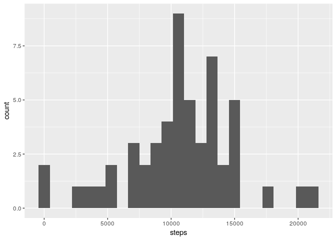
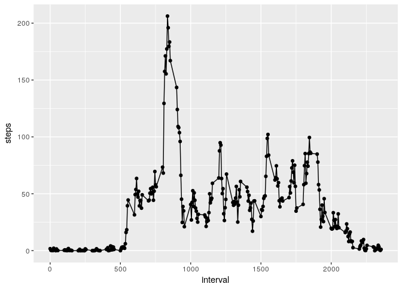
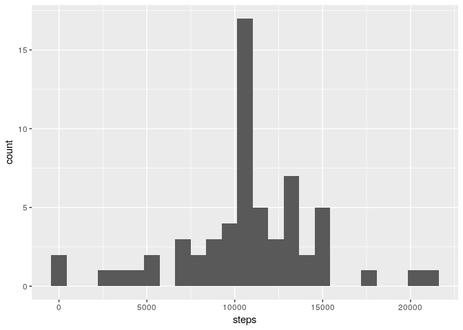
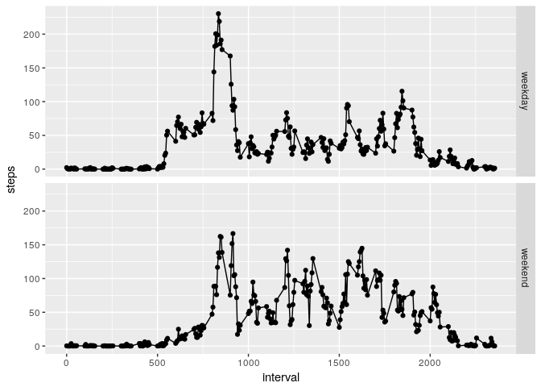

# Reproducible Research: Peer Assessment 1


```r
## source libraries
library(knitr)
library(ggplot2)

## set knitr global variables
opts_chunk$set(echo=T, warning=F, message=F)
```

## Loading and preprocessing the data

```r
steps <- read.csv(unz('activity.zip', 'activity.csv'))
steps$date <- with(steps, as.Date(date, '%Y-%m-%d'))
```

## What is mean total number of steps taken per day?

```r
## total number of steps taken per day
steps_by_day <- with(steps, aggregate(steps, list(date), sum))
colnames(steps_by_day) <- c('date','steps')

## histogram
qplot(steps, data=steps_by_day, bins=25) + labs(main='Total steps per day')
```

<!-- -->

The mean steps per day is $1.0766189\times 10^{4}$ and the median steps per day is $10765$.

## What is the average daily activity pattern?

```r
## average steps per interval
avg_day <- with(steps, aggregate(steps, list(interval), mean, na.rm=T))
colnames(avg_day) <- c('interval','steps')

## time series
qplot(interval, steps, data=avg_day) + geom_line() + labs(main='Average Daily Activity')
```

<!-- -->

The 5-minute interval, on average across all the days in the dataset, that contains the maximum number of steps is 835.

## Imputing missing values
The total number of rows with `NA`s is 2304.


```r
## impute missing values with interval steps average
steps_na <- is.na(steps$steps)
steps[steps_na,'steps'] <- avg_day[match(steps$interval[steps_na], avg_day$interval),'steps']

## total number of steps taken per day
steps_by_day <- with(steps, aggregate(steps, list(date), sum))
colnames(steps_by_day) <- c('date','steps')

## histogram
qplot(steps, data=steps_by_day, bins=25) + labs(main='Total steps per day')
```

<!-- -->

After imputing missing values with the average steps per interval, the mean steps per day is $1.0766189\times 10^{4}$ and the median steps per day is $1.0766189\times 10^{4}$. After imputing, the mean remained the same, but the median increased.

## Are there differences in activity patterns between weekdays and weekends?

```r
## add column for weekpart, i.e. weekday or weekend
steps$weekpart <- factor(ifelse(weekdays(steps$date)%in%c('Saturday','Sunday'),'weekend','weekday'))

## average steps per interval and weekpart
avg_day <- with(steps, aggregate(steps, list(weekpart, interval), mean))
colnames(avg_day) <- c('weekpart','interval','steps')

# time series for weekdays and weekends
qplot(interval, steps, data=avg_day, facets=weekpart~.) + geom_line()
```

<!-- -->
